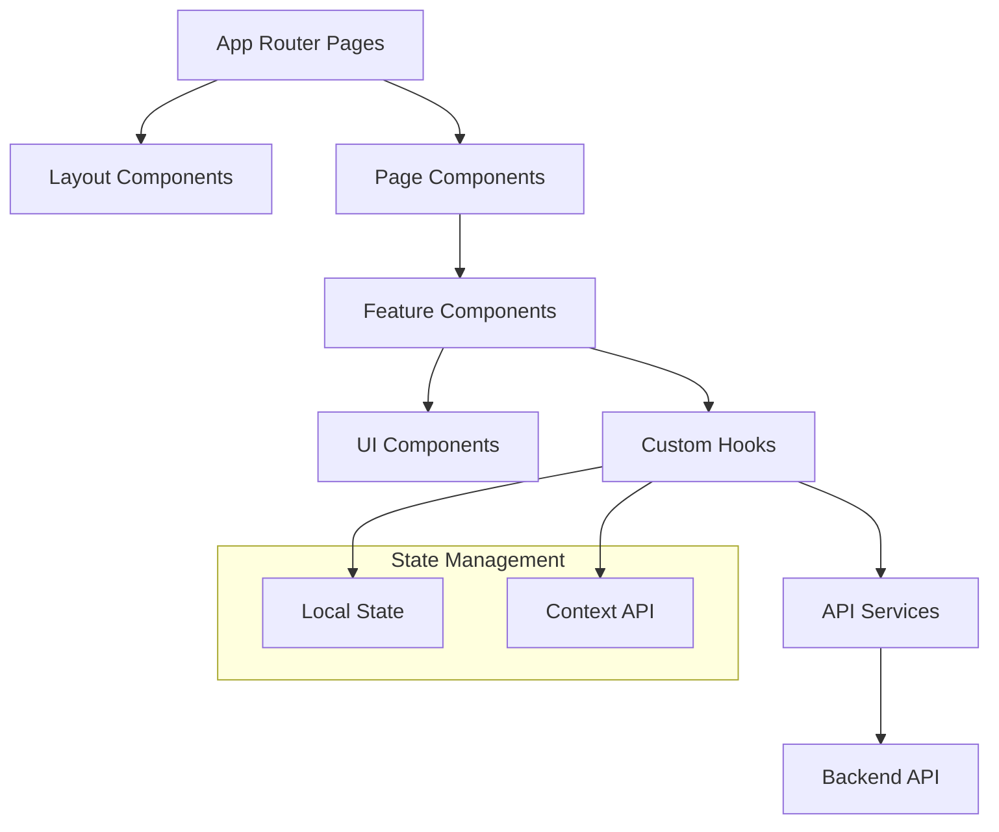

# Design Document

## Overview

植物監視システムのフロントエンドは、Next.js 14、TypeScript、Tailwind CSSを使用したモダンなWebアプリケーションです。バックエンドAPIからセンサーデータを取得し、直感的なダッシュボードで植物の環境データを表示します。レスポンシブデザインにより、デスクトップとモバイルの両方で最適な体験を提供します。

## 技術基礎知識

### Next.js とは

Next.jsは、Reactベースのフルスタックフレームワークです。以下の特徴があります：

#### 主要機能
- **App Router**: ファイルベースのルーティングシステム
- **Server Components**: サーバーサイドでレンダリングされるコンポーネント
- **Static Site Generation (SSG)**: ビルド時にHTMLを生成
- **Server Side Rendering (SSR)**: リクエスト時にサーバーでHTMLを生成
- **API Routes**: バックエンドAPIを同じプロジェクト内で作成可能

#### ディレクトリ構造の説明
```
src/app/                    # App Router（Next.js 13+の新機能）
├── layout.tsx             # 全ページ共通のレイアウト
├── page.tsx               # ホームページ（/にアクセスした時）
├── dashboard/             # /dashboardのルート
│   └── page.tsx          # ダッシュボードページ
└── plants/               # /plantsのルート
    ├── page.tsx          # 植物一覧ページ
    └── [id]/             # 動的ルート（/plants/123など）
        └── page.tsx      # 個別植物ページ
```

### React とは

Reactは、ユーザーインターフェースを構築するためのJavaScriptライブラリです。

#### 基本概念

**1. コンポーネント**
```typescript
// 関数コンポーネントの例
function PlantCard({ plant }) {
  return (
    <div className="card">
      <h3>{plant.name}</h3>
      <p>温度: {plant.temperature}°C</p>
    </div>
  );
}
```

**2. Props（プロパティ）**
```typescript
// 親コンポーネントから子コンポーネントにデータを渡す
<PlantCard plant={plantData} />
```

**3. State（状態）**
```typescript
// コンポーネント内でデータを管理
const [temperature, setTemperature] = useState(25);
```

**4. Effect（副作用）**
```typescript
// データ取得やイベントリスナーの設定
useEffect(() => {
  fetchPlantData();
}, []); // []は初回のみ実行を意味
```

### TypeScript とは

TypeScriptは、JavaScriptに型システムを追加した言語です。

#### 基本的な型定義
```typescript
// 基本型
const name: string = "植物A";
const temperature: number = 25.5;
const isHealthy: boolean = true;

// オブジェクト型
interface Plant {
  id: string;
  name: string;
  temperature: number;
  humidity: number;
}

// 配列型
const plants: Plant[] = [];

// 関数型
function updatePlant(id: string, data: Partial<Plant>): Promise<Plant> {
  // 実装
}
```

### Tailwind CSS とは

Tailwind CSSは、ユーティリティファーストのCSSフレームワークです。

#### 基本的な使い方
```html
<!-- 従来のCSS -->
<div class="card">
  <h3 class="title">タイトル</h3>
</div>

<!-- Tailwind CSS -->
<div class="bg-white rounded-lg shadow-md p-6">
  <h3 class="text-xl font-bold text-gray-800">タイトル</h3>
</div>
```

#### よく使うクラス
- `bg-white`: 背景色を白に
- `text-xl`: テキストサイズを大きく
- `font-bold`: フォントを太字に
- `p-6`: パディング（内側の余白）を設定
- `m-4`: マージン（外側の余白）を設定
- `rounded-lg`: 角を丸く
- `shadow-md`: 影を追加

## Architecture

### 技術スタック

- **フレームワーク**: Next.js 14 (App Router)
- **言語**: TypeScript 5.2+
- **スタイリング**: Tailwind CSS 3.3+
- **状態管理**: React useState/useEffect + カスタムフック
- **HTTP クライアント**: Fetch API
- **チャートライブラリ**: Chart.js / Recharts
- **テスト**: Jest + React Testing Library

### アーキテクチャパターン



## Components and Interfaces

### 1. ページ構造

#### App Router Structure
```
src/app/
├── layout.tsx              # ルートレイアウト
├── page.tsx                # ホームページ（ダッシュボード）
├── plants/
│   ├── page.tsx           # 植物一覧
│   └── [id]/
│       └── page.tsx       # 植物詳細
├── history/
│   └── page.tsx           # 履歴表示
└── settings/
    └── page.tsx           # 設定
```

### 2. コンポーネント階層

#### Layout Components
```typescript
// src/components/layout/AppLayout.tsx
interface AppLayoutProps {
  children: React.ReactNode;
}

// src/components/layout/Navigation.tsx
interface NavigationProps {
  currentPath: string;
}

// src/components/layout/Header.tsx
interface HeaderProps {
  title: string;
  actions?: React.ReactNode;
}
```

#### Dashboard Components
```typescript
// src/components/dashboard/DashboardOverview.tsx
interface DashboardOverviewProps {
  plants: Plant[];
  loading: boolean;
}

// src/components/dashboard/PlantCard.tsx
interface PlantCardProps {
  plant: Plant;
  latestData: SensorData;
  onSelect: (plantId: string) => void;
}

// src/components/dashboard/MetricsGrid.tsx
interface MetricsGridProps {
  metrics: {
    temperature: number;
    ph: number;
    // 将来的な拡張のための予約フィールド
    [key: string]: number;
  };
  thresholds: ThresholdConfig;
}
```

#### Chart Components
```typescript
// src/components/charts/TimeSeriesChart.tsx
interface TimeSeriesChartProps {
  data: SensorData[];
  dataType: DataType;
  timeRange: TimeRange;
  height?: number;
}

// src/components/charts/RealtimeChart.tsx
interface RealtimeChartProps {
  dataType: DataType;
  updateInterval: number;
  maxDataPoints: number;
}
```

#### Alert Components
```typescript
// src/components/alerts/AlertBanner.tsx
interface AlertBannerProps {
  alerts: Alert[];
  onDismiss: (alertId: string) => void;
}

// src/components/alerts/AlertCard.tsx
interface AlertCardProps {
  alert: Alert;
  onAcknowledge: () => void;
}
```

### 3. カスタムフック

#### データ取得フック
```typescript
// src/hooks/useApiData.ts
interface UseApiDataResult<T> {
  data: T | null;
  loading: boolean;
  error: string | null;
  refetch: () => void;
}

function useApiData<T>(url: string, options?: RequestOptions): UseApiDataResult<T>

// src/hooks/usePlantData.ts
interface UsePlantDataResult {
  plants: Plant[];
  selectedPlant: Plant | null;
  loading: boolean;
  error: string | null;
  selectPlant: (id: string) => void;
  refreshData: () => void;
}

function usePlantData(): UsePlantDataResult

// src/hooks/useSensorData.ts
interface UseSensorDataResult {
  data: SensorData[];
  latest: SensorData | null;
  loading: boolean;
  error: string | null;
  subscribe: (dataType: DataType) => void;
  unsubscribe: () => void;
}

function useSensorData(plantId: string): UseSensorDataResult
```

#### UI状態管理フック
```typescript
// src/hooks/useAlerts.ts
interface UseAlertsResult {
  alerts: Alert[];
  activeAlerts: Alert[];
  acknowledgeAlert: (id: string) => void;
  dismissAlert: (id: string) => void;
}

function useAlerts(): UseAlertsResult

// src/hooks/useTheme.ts
interface UseThemeResult {
  theme: 'light' | 'dark';
  toggleTheme: () => void;
}

function useTheme(): UseThemeResult
```

### 4. APIサービス

#### API Client
```typescript
// src/lib/api/client.ts
class ApiClient {
  private baseUrl: string;
  
  constructor(baseUrl: string);
  
  async get<T>(endpoint: string, params?: Record<string, any>): Promise<T>;
  async post<T>(endpoint: string, data: any): Promise<T>;
  async put<T>(endpoint: string, data: any): Promise<T>;
  async delete<T>(endpoint: string): Promise<T>;
}

// src/lib/api/endpoints.ts
export const API_ENDPOINTS = {
  DATA: '/api/v1/data',
  LATEST: '/api/v1/data/latest',
  SUMMARY: '/api/v1/data/summary',
  PLANTS: '/api/v1/plants',
} as const;
```

#### データサービス
```typescript
// src/lib/services/plantService.ts
interface PlantService {
  getPlants(): Promise<Plant[]>;
  getPlant(id: string): Promise<Plant>;
  addPlant(plant: CreatePlantRequest): Promise<Plant>;
  updatePlant(id: string, updates: UpdatePlantRequest): Promise<Plant>;
  deletePlant(id: string): Promise<void>;
}

// src/lib/services/sensorService.ts
interface SensorService {
  getData(params: GetDataParams): Promise<SensorData[]>;
  getLatestData(dataType: DataType): Promise<SensorData>;
  getSummary(params: GetSummaryParams): Promise<DataSummary>;
  subscribeToUpdates(callback: (data: SensorData) => void): () => void;
}
```

## Data Models

### 型定義

```typescript
// src/types/api.ts
export interface ApiResponse<T> {
  status: 'success' | 'error';
  data?: T;
  error?: {
    code: string;
    message: string;
    details?: string;
  };
  meta?: Record<string, any>;
  timestamp?: string;
}

// src/types/sensor.ts
export type DataType = 'temperature' | 'ph';
// 将来的な拡張: 'humidity' | 'pressure' | 'soil_moisture' | 'light'

export interface SensorData {
  timestamp: string;
  value: number;
  device_id: string;
  location: string;
}

export interface DataSummary {
  average: number;
  minimum: number;
  maximum: number;
  count: number;
  period: string;
}

// src/types/plant.ts
export interface Plant {
  id: string;
  name: string;
  species: string;
  location: string;
  device_id: string;
  created_at: string;
  updated_at: string;
  thresholds: ThresholdConfig;
}

export interface ThresholdConfig {
  temperature: { min: number; max: number };
  ph: { min: number; max: number };
  // 将来的な拡張のための予約フィールド
  [key: string]: { min: number; max: number };
}

// src/types/alert.ts
export interface Alert {
  id: string;
  plant_id: string;
  type: AlertType;
  severity: 'low' | 'medium' | 'high';
  message: string;
  timestamp: string;
  acknowledged: boolean;
  resolved: boolean;
}

export type AlertType = 
  | 'temperature_high' 
  | 'temperature_low'
  | 'ph_high'
  | 'ph_low';
// 将来的な拡張: 'humidity_high' | 'humidity_low' | 'soil_moisture_low' | 'light_low'
```

### データ変換

```typescript
// src/lib/utils/dataTransform.ts
export function transformSensorData(rawData: any[]): SensorData[] {
  return rawData.map(item => ({
    timestamp: item.timestamp,
    value: parseFloat(item.value),
    device_id: item.device_id,
    location: item.location
  }));
}

export function generateAlerts(
  data: SensorData[], 
  thresholds: ThresholdConfig,
  dataType: DataType
): Alert[] {
  // アラート生成ロジック
}
```

## Error Handling

### エラー境界

```typescript
// src/components/ErrorBoundary.tsx
interface ErrorBoundaryState {
  hasError: boolean;
  error: Error | null;
}

class ErrorBoundary extends React.Component<
  React.PropsWithChildren<{}>,
  ErrorBoundaryState
> {
  // エラー境界の実装
}
```

### APIエラーハンドリング

```typescript
// src/lib/utils/errorHandler.ts
export class ApiError extends Error {
  constructor(
    public status: number,
    public code: string,
    message: string,
    public details?: string
  ) {
    super(message);
  }
}

export function handleApiError(error: unknown): ApiError {
  // エラー処理ロジック
}

// src/hooks/useErrorHandler.ts
interface UseErrorHandlerResult {
  error: string | null;
  showError: (error: string) => void;
  clearError: () => void;
}

function useErrorHandler(): UseErrorHandlerResult {
  // エラー状態管理
}
```

### ユーザーフレンドリーなエラー表示

```typescript
// src/components/ui/ErrorMessage.tsx
interface ErrorMessageProps {
  error: string;
  retry?: () => void;
  onDismiss?: () => void;
}

// src/components/ui/LoadingSpinner.tsx
interface LoadingSpinnerProps {
  size?: 'sm' | 'md' | 'lg';
  message?: string;
}
```

## Testing Strategy

### テスト構成

```typescript
// __tests__/setup.ts
import '@testing-library/jest-dom';

// Mock API responses
export const mockApiResponse = <T>(data: T): ApiResponse<T> => ({
  status: 'success',
  data
});
```

### コンポーネントテスト

```typescript
// __tests__/components/PlantCard.test.tsx
describe('PlantCard', () => {
  it('displays plant information correctly', () => {
    // テスト実装
  });
  
  it('shows alert when thresholds are exceeded', () => {
    // テスト実装
  });
});
```

### フックテスト

```typescript
// __tests__/hooks/usePlantData.test.tsx
describe('usePlantData', () => {
  it('fetches plant data on mount', () => {
    // テスト実装
  });
  
  it('handles API errors gracefully', () => {
    // テスト実装
  });
});
```

### 統合テスト

```typescript
// __tests__/integration/dashboard.test.tsx
describe('Dashboard Integration', () => {
  it('displays real-time data updates', () => {
    // 統合テスト実装
  });
});
```

## Performance Optimization

### レンダリング最適化

- React.memo でコンポーネントメモ化
- useMemo/useCallback でコンピュテーション最適化
- 仮想化リストで大量データ表示

### データ取得最適化

- SWR/React Query でキャッシュ管理
- デバウンス処理でAPI呼び出し制限
- バックグラウンド更新でUX向上

### バンドル最適化

- Dynamic imports でコード分割
- Tree shaking で未使用コード除去
- 画像最適化でロード時間短縮

## Responsive Design

### ブレークポイント

```typescript
// tailwind.config.js
module.exports = {
  theme: {
    screens: {
      'sm': '640px',
      'md': '768px',
      'lg': '1024px',
      'xl': '1280px',
      '2xl': '1536px',
    }
  }
}
```

### レスポンシブコンポーネント

```typescript
// モバイルファーストアプローチ
<div className="grid grid-cols-1 md:grid-cols-2 lg:grid-cols-3 gap-4">
  {/* グリッドレイアウト */}
</div>

// 条件付きレンダリング
{isMobile ? <MobileNavigation /> : <DesktopNavigation />}
```

## Accessibility

### ARIA属性とセマンティクス

```typescript
<button
  aria-label="植物データを更新"
  aria-describedby="refresh-help"
  onClick={handleRefresh}
>
  <RefreshIcon />
</button>
```

### キーボードナビゲーション

- Tab順序の適切な管理
- フォーカス表示の明確化
- ショートカットキーの実装

### スクリーンリーダー対応

- 適切な見出し構造
- 代替テキストの提供
- 状態変更の通知