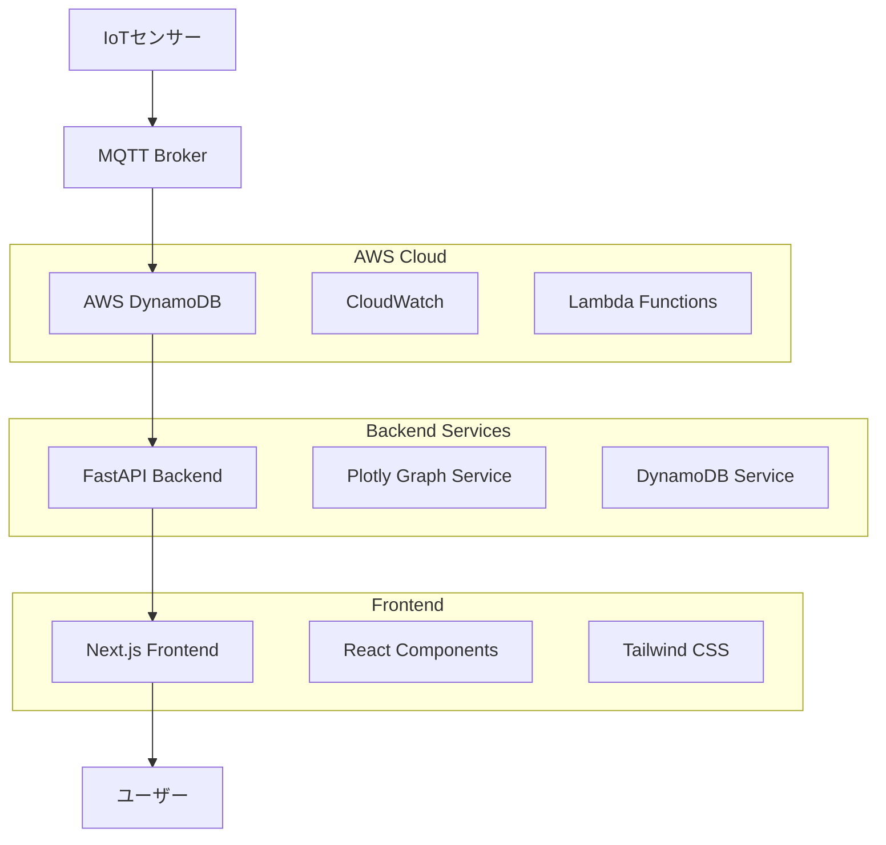
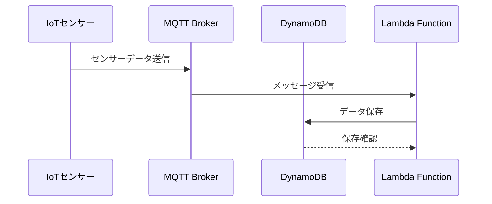
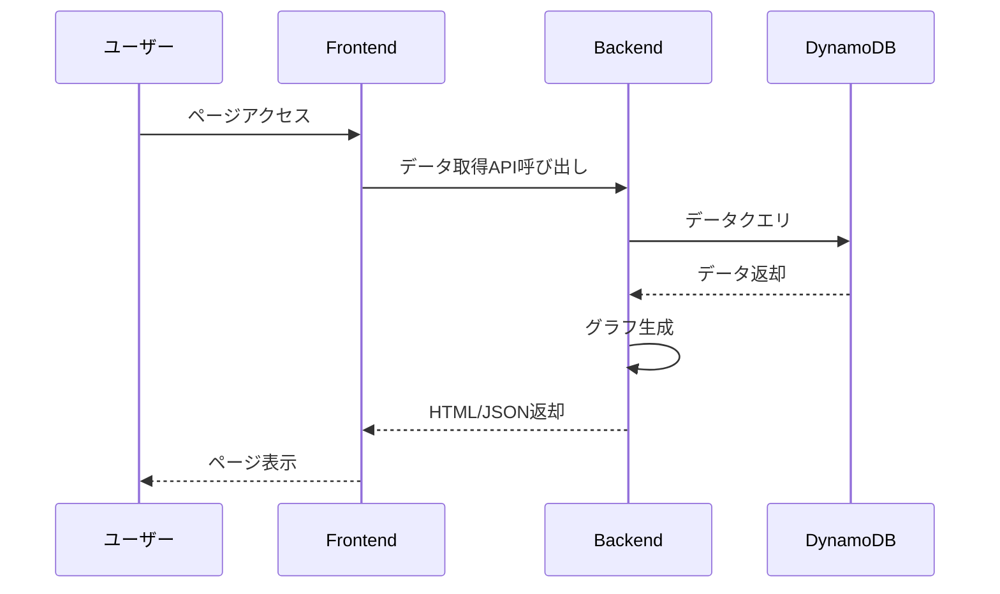

# システムアーキテクチャ

## 概要

TCS-kanazawa-gw植物監視システムは、IoTセンサーからクラウドまでの完全なデータパイプラインを提供するフルスタックアプリケーションです。

## システム構成

### 全体アーキテクチャ



## コンポーネント詳細

### 1. データ収集層

#### IoTセンサー
- **役割**: 環境データの収集
- **データ種別**: 温度、湿度、土壌水分、光量
- **通信プロトコル**: MQTT
- **サンプリング間隔**: 5分間隔

#### MQTT Broker
- **役割**: センサーデータの中継
- **プロトコル**: MQTT 3.1.1
- **QoS**: Level 1 (At least once delivery)

### 2. データ保存層

#### AWS DynamoDB
- **テーブル名**: `aggdata_table`
- **パーティションキー**: `data_type` (String)
- **ソートキー**: `timestamp` (String)
- **属性**:
  - `value` (Number): センサー値
  - `device_id` (String): デバイス識別子
  - `location` (String): 設置場所

**テーブル設計例**:
```json
{
  "data_type": "temperature",
  "timestamp": "2025-01-26T10:30:00Z",
  "value": 23.5,
  "device_id": "sensor_001",
  "location": "greenhouse_a"
}
```

### 3. バックエンド層

#### FastAPI Application
- **フレームワーク**: FastAPI 0.115+
- **Python**: 3.12+
- **主要機能**:
  - データ取得API
  - グラフ生成
  - 設定管理

#### サービス構成

**DynamoDB Service** (`app/services/dynamodb.py`):
```python
class DynamoDBService:
    def get_data(self, data_type: str, start_time: str, end_time: str)
    def get_latest_data(self, data_type: str)
    def get_data_summary(self, data_type: str, period: str)
```

**Graph Service** (`app/services/graph.py`):
```python
class GraphService:
    def create_time_series_plot(self, data: List[Dict])
    def create_histogram(self, data: List[Dict])
    def create_comparison_chart(self, data: Dict[str, List])
```

### 4. フロントエンド層

#### Next.js Application
- **フレームワーク**: Next.js 14 (App Router)
- **TypeScript**: 5.2+
- **スタイリング**: Tailwind CSS 3.3+

#### コンポーネント構成

```
src/
├── app/                    # App Router
│   ├── layout.tsx         # ルートレイアウト
│   ├── page.tsx           # ホームページ
│   └── dashboard/         # ダッシュボード
├── components/            # 再利用可能コンポーネント
│   ├── charts/           # グラフコンポーネント
│   ├── ui/               # UIコンポーネント
│   └── layout/           # レイアウトコンポーネント
├── hooks/                # カスタムフック
├── lib/                  # ユーティリティ
└── types/                # 型定義
```

## データフロー

### 1. データ収集フロー



### 2. データ表示フロー



## セキュリティ

### 認証・認可
- **AWS IAM**: DynamoDBアクセス制御
- **環境変数**: 機密情報の管理
- **HTTPS**: 通信の暗号化

### データ保護
- **データ暗号化**: DynamoDB暗号化
- **アクセスログ**: CloudWatch Logs
- **監査**: AWS CloudTrail

## パフォーマンス

### バックエンド最適化
- **接続プール**: DynamoDBクライアント
- **キャッシュ**: Redis (将来実装予定)
- **非同期処理**: FastAPI async/await

### フロントエンド最適化
- **静的生成**: Next.js SSG
- **画像最適化**: Next.js Image
- **コード分割**: Dynamic imports

## 監視・ログ

### メトリクス
- **アプリケーションメトリクス**: CloudWatch
- **エラー追跡**: CloudWatch Logs
- **パフォーマンス**: X-Ray (将来実装予定)

### アラート
- **データ異常**: CloudWatch Alarms
- **システム障害**: SNS通知
- **リソース使用量**: Auto Scaling

## スケーラビリティ

### 水平スケーリング
- **バックエンド**: ECS/Fargate
- **フロントエンド**: CDN配信
- **データベース**: DynamoDB Auto Scaling

### 垂直スケーリング
- **コンピュートリソース**: EC2インスタンスタイプ変更
- **ストレージ**: DynamoDB容量調整

## 災害復旧

### バックアップ
- **データベース**: DynamoDB Point-in-time Recovery
- **コード**: Git リポジトリ
- **設定**: Infrastructure as Code

### 復旧手順
1. データベース復旧
2. アプリケーション再デプロイ
3. 動作確認
4. 監視再開

## 今後の拡張

### 短期計画
- リアルタイムデータ更新 (WebSocket)
- アラート機能
- データエクスポート機能

### 長期計画
- 機械学習による予測機能
- モバイルアプリケーション
- マルチテナント対応